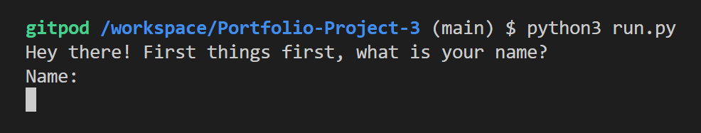
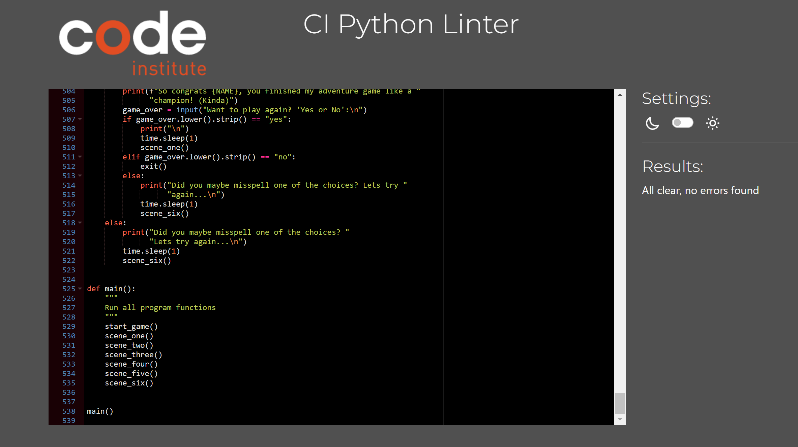

# Adventure Time!
 
 ## Welcome to my third Portfolio Project!
This is my third project (of five) for my full-stack dev. course at [Code Institute](https://codeinstitute.net) and this time i chose an adventure game. This project is written in Python only, so it's CLI for the win. It runs in the CI mock terminal on [Heroku](www.heroku.com).   The user gets to follow Petra around on an adventure and with simple commands guide
her through a series of choices to finally complete the game. The propose of this game is to give the user a fun, positive experience.    Here is a link to the game can be found [here]()
  
 

## Technologies Used

 For this project we were allowed to use:

 - [Python](https://en.wikipedia.org/wiki/Python_(programming_language))
 - As IDE i used [Visual Studio Code](https://visualstudio.microsoft.com/) and [Gitpod](https://www.gitpod.io/)

## Features

* ### Introduction
    * The user is prompted to write his/her/their name. And then answer if the user is ready to start the game.

 

* ### The Adventure
    * When the user is ready the game starts with little Petra in the forrest.

 

    

* ### Imports, Libraries
    * The import used is Time. 
    * This improves the experience for the user and makes it easier to follow along.

 

## Testing

* Tested on three diffrent terminals:
    * VS Code
    * Gitpod
    * Heroku
* Tested every possible choice.
* Tested misspelling on every choice.

### Validator Testing

* #### PEP8 Validator
    * The pep8 validator used is from [Code Institute](https://codeinstitute.net)
    * Link to it can be found here: [Python PEP8 validator from CI](https://pep8ci.herokuapp.com/)

 
  

### Bugs

#### No major bugs encountered

## Deployment
* Steps for deployment on [Heroku](https://www.heroku.com/)
    * Fork or clone this github repository.
    * Create a new Heroku app.
    * Set the Buildpacks to python and node.js (in that order).
    * Link the heroku app to the repository.
    * Click on 'deploy'.

## Credits
* [The Love Sandwiches Project](https://github.com/codingbyfreddish/love-sandwiches) from [CI](https://codeinstitute.net).
* All the course material from [CI's 'Full Stack Developer'](https://codeinstitute.net/se/full-stack-software-development-diploma/) curriculum leading up to this project.
### Content
* The story is from [Chatgpt](https://chat.openai.com/auth/login). Searched for "Write a story for an adventure game with multiple choices containing 10 scenes" (i shorted it abit).
* The deployment section in this readme file is from the sample from [Code Institute](https://codeinstitute.net).

## Acknowledgments
* **My mentor Ronan McClelland gave me not only the tip where to get the story but also many other things to keep in mind when writing this project. Thank you, sir :)**

